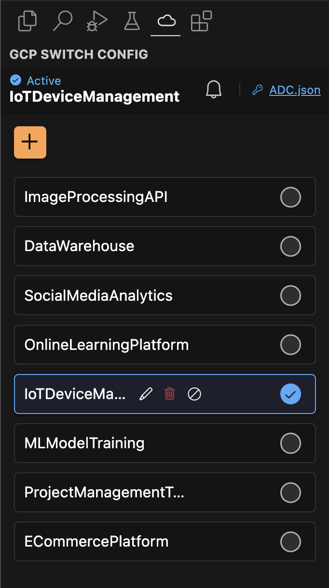

# GCP Switch Configuration

Simplify your Google Cloud Platform (GCP) experience with the "GCP Switch Configuration" VSCode extension.

Seamlessly switch between different GCP configurations with just a few clicks!

## Features

- **Easy Switching**: Quickly toggle between GCP configurations directly from VSCode.
- **Convenient Access**: Use commands or a handy status bar button to open the extension's webview.
- **User-Friendly Interface**: Intuitive webview layout for hassle-free navigation.

## Installation

Go to Extensions and Search for `GCP Switch Configuration` and install.

OR:

Visit VScode Marketplace [GCP Switch Configuration](https://marketplace.visualstudio.com/items?itemName=tikou-web.gcp-switch-config)

## Usage

- **Open via Command**: `Ctrl+Shift+P` and type "GCP Switch"

OR

- **Status Bar Button**: Click the "gcp-switch-config" button in the status bar

## Extension screens

### Dashboard

From the dashboard, you can **manage** all your gcp configurations.

**Search for configurations** just like if you were using google cloud platform console.

with `ADC.json` link, you have Quick access to `application_default_configuration.json` of active configuration.

### Configuration form

Manage your configurations with a **simple form**, you can create, update and delete configurations.

Search for project to attach to you configuration with autocomplete input in the form.

### Fully Responsive UI with Dark/Light mode

Enjoy streamlined GCP project management right within VSCode!

## Feedback

Your feedback is valuable! If you have suggestions or encounter issues, please open an issue on this GitHub repository.
